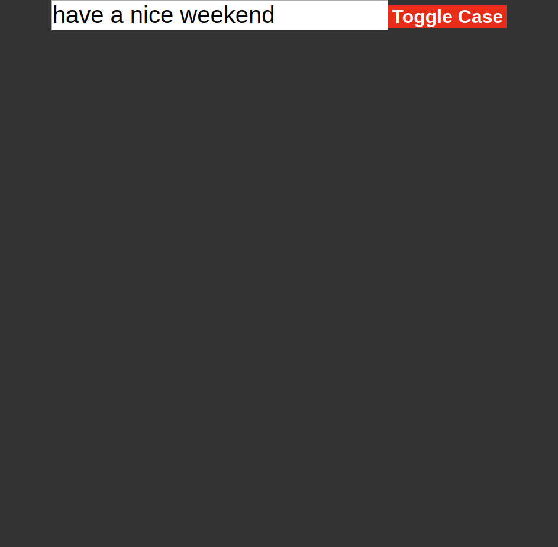

# react-refs

This site was created by Stefan Klinkusch at Digital Career Institute in Berlin, Germany using React.js

## Features

It features 
- an input field where the user can write some text
- a button to toggle if the text in the input field is written using uppercase letters or lowercase letters (default is: lowercase)

## Screenshot

